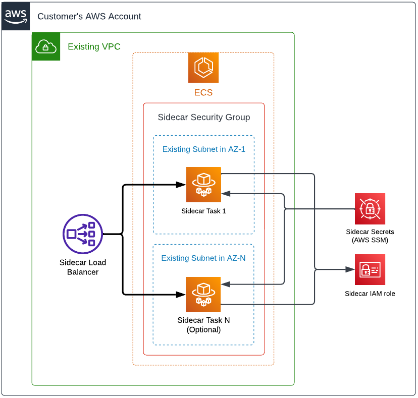

# Sidecar - Terraform AWS ECS

A quick start to deploy a sidecar to AWS EC2 using Terraform!

This guide explains how to deploy a basic sidecar on AWS using ECS Fargate.
This example provides only the necessary configuration to
deploy a sidecar container. For more details, please read the
[Cyral DIY Deployment](https://cyral.com/docs/sidecars/deployment/#custom-deployment-diy)
documentation.

By following the steps of this guide, you will deploy a sidecar to ECS Fargate.

> If you prefer to deploy a sidecar to AWS EC2 instead, see
> our [Terraform AWS EC2 Quickstart](https://github.com/cyralinc/terraform-aws-sidecar-ec2).

---

## Deployment

### Architecture



### Examples

#### Quick Start

* Save the code below in a `.tf` file (ex `sidecar.tf`) in a new folder.
    * Fill the parameters `sidecar_id`, `control_plane`, `client_id` and 
    `client_secret` with the information from the `Cyral Templates` option
    in the `Deployment` tab of your sidecar details.
    * Fill the parameters `vpc_id` and `subnets` with an existing VPC and subnets that allows 
    network connectivity to the Cyral control plane (outbound HTTPS and gRPC traffic using port `443`)
    and to the database you plan to protect with this sidecar.

* Open a command line terminal in the new folder.
* Configure the AWS CLI credentials or provide them through environment variables.
* Run `terraform init` followed by `terraform apply`.

```hcl
provider "aws" {
  # Define the target AWS region
  region = "us-east-1"
}

module "cyral_sidecar" {
  source = "github.com/cyral-quickstart/quickstart-sidecar-aws-ecs"
  version = "main"

  sidecar_version = "v4.15.0"

  sidecar_id    = ""
  control_plane = ""
  client_id     = ""
  client_secret = ""

  # The ports that the sidecar will allow for incoming connections.
  # The set of ports below includes the default ports for all of
  # our currently supported repositories and considers MongoDB
  # ports in the range from 27017 to 27019.
  sidecar_ports = [
    443, 453, 1433, 1521, 3306, 5432, 5439, 9996, 9999,
    27017, 27018, 27019, 31010
  ]
  vpc_id  = "<vpc-id>"
  subnets = ["<subnet-id>"]

  #############################################################
  #                       DANGER ZONE
  # The following parameters will expose your sidecar to the
  # internet. This is a quick set up to test with databases
  # containing dummy data. Never use this configuration if you
  # are binding your sidecar to a database that contains any
  # production/real data unless you understand all the
  # implications and risks involved.

  # If you provided private subnets, set this to `false`
  associate_public_ip_address = true

  # Unrestricted inbound to ports defined in `sidecar_ports`
  db_inbound_cidr         = ["0.0.0.0/0"]
  # Unrestricted inbound to monitor EC2 instances (port 9000)
  monitoring_inbound_cidr = ["0.0.0.0/0"]
  #############################################################
}
```
